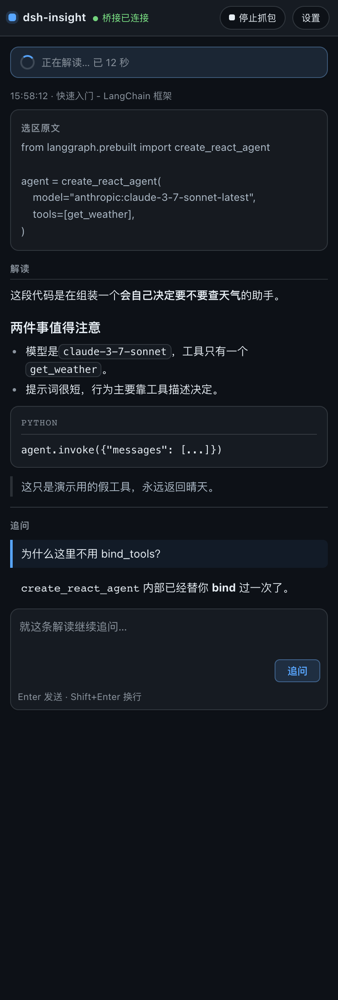

# dsh-insight

**A browser companion for dsh (DeepSeek Harness).** Select any text on a page and get an instant interpretation, then keep discussing it in the side panel — while giving the dsh agent eyes and hands on the browser: read pages, click, capture traffic, open tabs.



## Features

### Select-to-interpret

Select text and a small badge appears (label configurable, default "解读"). Click it and the **selection text + page URL + title** are sent to your local dsh; the answer is rendered as Markdown.

Four trigger/display modes:

| Mode | Trigger | Where the result goes |
| --- | --- | --- |
| `click` (default) | select, then click the badge | floating card on the page |
| `click-sidebar` | select, then click the badge | side panel only |
| `auto` | interpret on select (~0.45 s after you stop) | floating card on the page |
| `auto-sidebar` | interpret on select | side panel only, nothing appears on the page |

The same text is only interpreted once. When you keep selecting, newer selections **queue up and supersede** older ones instead of being dropped mid-flight. The floating card can either follow the selection or stay pinned to the bottom-right.

### Native multi-turn follow-up in the side panel

An input box sits right below the answer (`Enter` to send, `Shift+Enter` for a newline). Follow-ups are real multi-turn requests carrying the last 16 turns (4000 chars each) — no jumping elsewhere to start a new session.

### Settings live in the side panel

Click **设置** in the panel header to switch in place; the button becomes **返回解读**. No detour to the extension options page. The settings view is lazily loaded.

### Configurable appearance

Panel background color and font size (11–20 px), following light/dark theme.

### Interpretation presets: built-in + custom

Six built-in presets: **默认解读**, **一句话讲清**, **直译 + 术语**, **代码 / 报错讲解**, **批判性审阅**, **讲给完全不懂的人**.

Built-ins are **editable** (edits are stored as an override layer and can be reset), and you can add any number of custom presets.

### Agent-side `browser_*` tools

With the host half installed, the dsh agent gets 8 tools: `browser_get_page`, `browser_list_tabs`, `browser_navigate`, `browser_click`, `browser_open_tab`, `browser_start_capture`, `browser_stop_capture`, `browser_capture_requests`.

Traffic capture uses CDP and **redacts credentials by default** (`redactCredentials: true`). Actions that mutate the page (navigate / click / open tab / start capture) additionally require explicit intent keywords in the current user message — that is a prompt-injection gate, not a bug.

## Layout

Both halves are required:

| Path | Role |
| --- | --- |
| `extension/` | MV3 extension: side panel, selection, floating card, settings |
| `host/bridge.js` | WebSocket bridge between extension and dsh (`/dsh-insight/bridge`) |
| `host/browser-tools.js` | registers the `browser_*` tools |
| `host/insight.js` | the interpretation route, `POST /dsh-insight` |
| `host/page-injector.js` | injects "current page" into the session — **not mounted by default**, see below |

Protocol details: `docs/bridge-protocol.md` (Chinese).

## Requirements

- A running dsh with the web profile enabled (default `http://127.0.0.1:3080`)
- Node.js ≥ 18 and pnpm (`dsh plugin` shells out to it)
- Chrome or Edge ≥ 118

## Install

### 1. Host half

```bash
dsh plugin --profile web add github:Suguyun/dsh-insight
```

This installs the package and writes `dsh-insight` into that profile's `dsh.profile.bundles` (`dsh plugin` is a pnpm forwarder that reconciles the bundle list afterwards).

> **Why not `link:` to a local clone?** Node resolves dependencies by a module's *real path*. A symlinked package physically lives outside the profile and therefore cannot resolve dsh's own `@deepseek-ai/dsh-llm`, so the plugins fail to load.

If HTTPS access to github.com is restricted (so the `github:` spec cannot be fetched), clone over SSH **inside** the profile directory instead — that keeps it within the profile, so dependencies resolve:

```bash
cd ~/.dsh/profiles/web
git clone git@github.com:Suguyun/dsh-insight.git
dsh plugin --profile web add ./dsh-insight
```

### 2. Extension

**Option A — use the release package (no CLI needed)**

Download `dsh-insight-<version>.zip` from [Releases](https://github.com/Suguyun/dsh-insight/releases) and unzip it into a directory you will **keep in place** (`manifest.json` sits at the root of the unzipped folder).

**Option B — CLI**

```bash
npx github:Suguyun/dsh-insight install
```

It copies the extension to a stable per-user directory and prints the path.
Note: this package is **not published to npm**, so the `github:` prefix is required — a bare `npx dsh-insight` will fail.

Either way, then — **select the directory that directly contains `manifest.json`**:

1. Open `chrome://extensions` (or `edge://extensions`) and enable Developer mode;
2. Choose "Load unpacked" and select that directory;
3. Click the toolbar icon to open the side panel.

With the CLI the directory is `…/dsh-insight/` **itself**, with the manifest at its root — there is deliberately **no nested** `extension/` level. Picking the parent yields "manifest file is missing or unreadable"; Edge is right, that level has no `manifest.json`.

The extension is loaded **in place** from that directory: after editing sources (or upgrading), copy the files again and hit "Reload" on the extensions page. Do not delete the directory, or the extension breaks.

### 3. Verify

The panel header should read **「桥接已连接」** (bridge connected). If it says disconnected, make sure dsh is running, the URL is right, then reload the page.

## Data flow and privacy

- Selection interpretation POSTs the **selection text + page URL / title** to `{your dsh}/dsh-insight`, and dsh generates the answer with the model *you* configured. Whether that text leaves your machine depends on your model provider — that layer is dsh's decision, not this extension's.
- The extension's own outbound requests are **only two kinds, both to localhost**: your configured dsh origin (default `127.0.0.1:3080`) and the CDP endpoint `127.0.0.1:9222` used as a fallback for cross-extension pages. No telemetry, no third-party endpoints.
- **Automatic page injection is off by default** (both layers: the host plugin is not mounted, and the extension push flag defaults to `false`). If you enable it, page bodies you browse will enter the model context.
- Capture is redacted by default; raw traffic requires explicitly setting `redactCredentials: false` in `cordis.patch.yml`.

## Permissions

| Permission | Why |
| --- | --- |
| `sidePanel` | the side panel itself |
| `storage` | settings and the last interpretation |
| `tabs` / `activeTab` | list tabs, read the active tab |
| `scripting` | inject scripts to read text/links and to click |
| `webNavigation` | push page changes on tab switch / navigation / SPA route change |
| `debugger` | capture network requests via CDP (`Network.enable`) |
| `<all_urls>` | the content script needs to run on any page you browse |

`debugger` is a strong permission and is used only for capture; it shows the "being debugged" banner on the target tab and detaches when capture stops.

Also note: **another extension's `chrome-extension://` pages** can be neither scripted nor read via `debugger`; the only channel is the browser remote debugging protocol, so reading those requires launching the browser with `--remote-debugging-port=9222`.

## Configuration

Settings (dsh URL, badge label, trigger mode, card position, panel background/font size, interpretation preset) live in `chrome.storage.local`:

| Key | Meaning |
| --- | --- |
| `dsh_url` | dsh origin |
| `insight_mode` | `click` / `click-sidebar` / `auto` / `auto-sidebar` |
| `insight_label` | badge text |
| `insight_position` | `follow` / `fixed` |
| `insight_preset` | selected preset id |
| `insight_system` | effective preset text |
| `insight_overrides` | edits to built-in presets |
| `insight_custom` | custom presets |
| `insight_thread` | follow-up thread |
| `last_insight` | last interpretation record |
| `panel_bg` / `panel_font_size` | panel appearance |
| `insight_autopush` | page push flag, **default `false`** |

```js
chrome.storage.local.set({ insight_mode: "auto-sidebar" });
```

### Enabling automatic page injection

Both must be turned on — enabling only one silently does nothing:

1. Uncomment the `dsh-insight-page-injector` rows in `cordis.patch.yml`;
2. `chrome.storage.local.set({ insight_autopush: true })`.

The implementation here is **bounded**: at most 4000 chars per injection, whole injection skipped when the body contains its own marker (self-echo), and a 60000-char per-session budget.

## Known limitations

- Panel width is browser-controlled (Chrome's minimum is ~320 px); extensions cannot set it.
- The Markdown renderer is dependency-free and self-written: **no table support**; headings, lists, quotes, fenced code, inline code, bold and links are supported.
- Verified on Chrome / Edge (MV3) only, not on Firefox.
- Interpretation handles a single selection only; it does not summarize whole pages.
- Interpretation creates no session and writes no logs — it is a one-shot Q&A.

## Development

```bash
git clone https://github.com/Suguyun/dsh-insight
cd dsh-insight
node tests/run.mjs      # or: npm test
```

`tests/` holds 15 self-contained suites with 137+ assertions covering trigger modes, the request queue, the orphaned-content-script guard, panel views and follow-ups, Markdown rendering, the options page, presets and capture redaction.

Each suite ships its own DOM / chrome API stubs and imports repository sources directly — no build step. `test-host-mt` and `test-presets` exercise `host/insight.js` and need dsh's `@deepseek-ai/dsh-llm` to resolve; in a bare clone they print `SKIP` and count as skipped rather than failing.

The panel screenshot (`docs/screenshot.png`) is rendered with headless Edge + playwright-core.

## Credits

This project is a fork of [stuarthu/dsh-chrome](https://github.com/stuarthu/dsh-chrome) (MIT). Upstream provided the original bridge, browser tools and page injector; this repository adds select-to-interpret, native multi-turn follow-up, in-panel settings and appearance customization, and tightens page injection and body-size limits. The upstream copyright and permission notice is retained in `LICENSE` as MIT requires.

## License

MIT — see [`LICENSE`](LICENSE).
